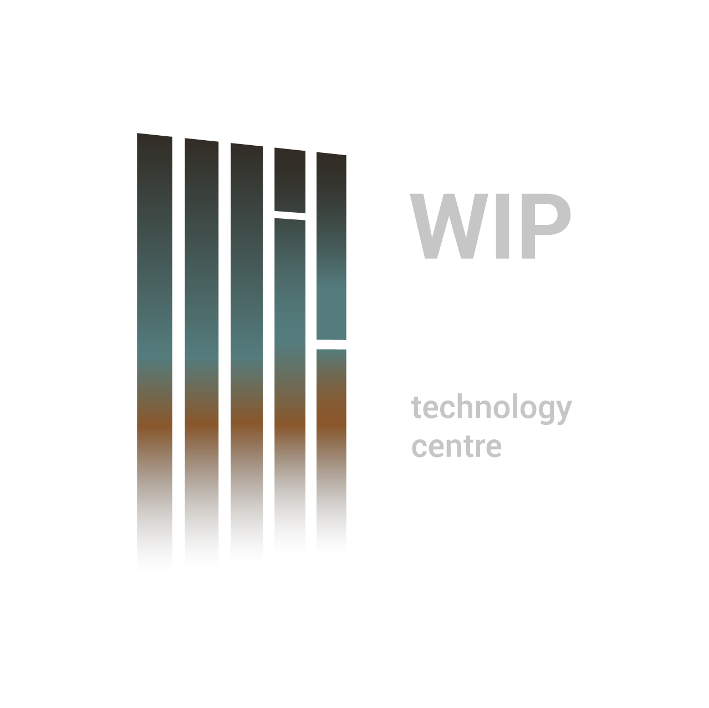

# WIP

# Desafio Front-end React

## 🎯 Objetivo
Desenvolver uma interface funcional React, usando dropdowns dinâmicos com dependências e geracão automática de um código identificador. Este desafio avalia nao apenas a capacidade técnica, mas também o ritmo de trabalho e capcidade de previsão.

## 📝 Tarefas Iniciais
--> Escolher uma biblioteca de componentes 

--> Estimar o tempo necessário para o desenvolvimento

--> Desenvolver a página em React

--> Implementar a lógica de geracao de código (campo PK)

--> Associar o botão "Gravar" à geracão do JSON final

--> Dropdowns com filtro por texto

--> Validacão de campos numéricos

## 📚 Biblioteca de Componentes
Escolha: 

Motivo:

## 🗓️ Previsão de Tempo
1 dia para estudo e aprendizagem do React e biblioteca de componentes;

3 dias para construir o website (back-end e Front-end):

    dia 2- Lógica dropdowns + fetch mock;
    
    dia 3- Lógica de verificação (verify);
    
    dia 4- Gravar e gerar o JSON final.
    
1 dia para resolver bugs.

## 🔒Regras  

  ### ✍️ Campos
n pares: campo numérico (int), max 999.

Cliente, Marca, Cor/ Sortimento, Tamanho: dropdowns filtráveis.

Outros campos: texto livre.

Pesos e medidas: apenas valores numéricos.

  ### 🧩 Geracão do Código (PK)
  Ao clicar no botao Verify, será gerado o campo PK com a seguinte estrutura:
PK<Pares><Cliente><Marca><Cor><Tamanho><Certificacao>

  ### 🔽 Dropdowns com Dependências
Cliente --> Marca

Marca --> Cor/Sortimento

  ### 🛠️ Mock API Endpoints
  1️⃣Menu Inicial ("Create Articles")

{
 "success" : true,
 
 "data" : [
  "PM",
  "PK",
  "AC",
  "KS"
 ]
}

  2️⃣Escolha de Tipo "PK" (exibe restantes campos)

{
 "success" : true,
 
 "customer": [
  {"001" : "WIP"},
  {"025" : "IPCA"}
 ],
 
 "certification": [
  {"001" : "GOTS"},
  {"002" : "BLUE"},
  {"003" : "GREEN"}
 ],
 
 "unit": [
  {"001" : "UN"},
  {"002" : "PK"},
  {"003" : "PAIR"},
 ],
 
 "currency": [
  {"001" : "EUR"},
  {"002" : "USD"},
  {"003" : "JPY"},
  {"004" : "GBP"},
 ],
 
 "sustComp": [
  {"001" : "ECO"},
  {"002" : "WOOL"},
  {"003" : "GRTXT"},
 ],
}

3️⃣**Brand(dependente de Cliente)**

_Cliente 001 - WIP_
{
  "success": true,
  
  "data": [
    {"001": "WIPTech Pro"},
    {"253": "WIPTech Ultra"},
    {"563": "WIPTech Standard"}
  ]
}

_Cliente 025 - IPCA_

{
  "success": true,
  
  "data": [
    {"009": "IPCA 1"},
    {"632": "IPCA 2"}
  ]
}

4️⃣**Cor/Sortimento (dependnete de Marca)**
_Exemplo Marca 001 - WIPTech Pro_

{
  "success": true,
  
  "data": [
    {"002": "Pure Red"},
    {"006": "Soft White"},
    {"009": "Sunset Orange"}
  ]
}

  ### 💾 Gravacão
O botão "Gravar" deve:
Gerar um JSON com todos os campos preenchidos;
Remover a chave "Success" das respostas mock;
Incluir campos de texto livre e dropdowns com os códigos e valores selecionados.

## 📂 Estrutura Planeada
