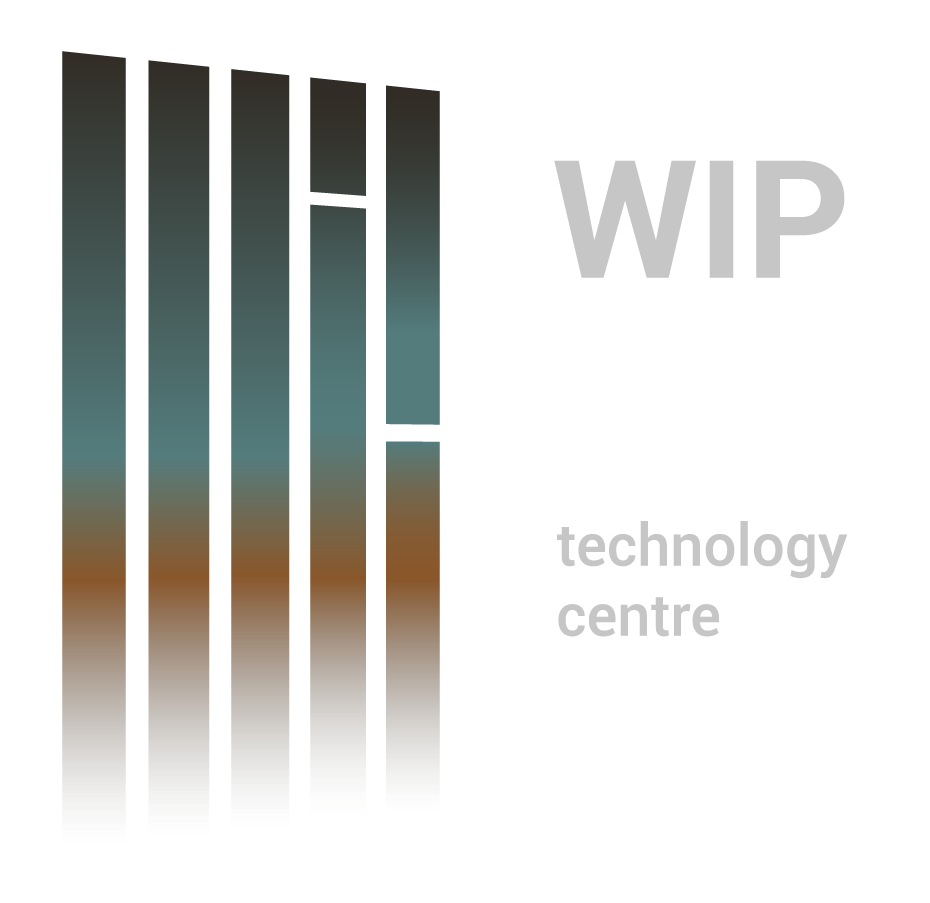

# WIP - Technology Centre

# Desafio Front-end React
Este repositório contém a solução para o Desafio Técnico de Front-end proposto pela WIP.  
O projeto consiste no desenvolvimento de uma interface funcional em React, com dropdowns dinâmicos interdependentes e geração automática de um código identificador.  
Este desafio tem como objetivo avaliar não apenas a competência técnica, mas também a organização, o ritmo de trabalho e a capacidade de antecipar requisitos.

## 📝 Tarefas Iniciais
- Escolher uma biblioteca de componentes 

- Estimar o tempo necessário para o desenvolvimento

- Desenvolver a página em React

- Implementar a lógica de geracao de código (campo PK)

- Associar o botão "Gravar" à geracão do JSON final

- Dropdowns com filtro por texto

- Validacão de campos numéricos

## 📚 Biblioteca de Componentes
Para a biblioteca de componenetes foi esoclhida a **Shadcn UI**.
A Shadcn UI é uma biblioteca moderna de componentes React, construida com Tailwind CSS e baseada em Radix UI. Foi desenhada para fornecer componentes acessiveis e altamente personalizaveis. 

## 🗓️ Timeline do Projeto
- 1 dia para estudo e aprendizagem de React e da biblioteca de componentes;

- 3 dias para construcão do website (back-end e Front-end):

    dia 2- Lógica dos dropdowns + fetch mock;
    
    dia 3- Lógica de verificação (verify);
    
    dia 4- Gravacão e geracão do JSON final.
    
- 1 dia para resolucão de bugs.

## 🛠️Tecnologias Utilizadas
- Visual Studio Code: Editor de código.
- React: Biblioteca JavaScript para construcao da interface
- TypeScript: Superset de JavaScript que adiciona tipagem estática ao código, auemntando a seguranca e escalabilidade do proejto
- Vite: Ferramenta de build rápida, usada para configurar o ambiente de desenvolvimento com React + TypeScript
- Tailwind CSS: Framework de estilos utilitarios.
- Shadcn UI: Biblioteca de componentes React.
- Radix UI (base do shadcn): conjunto de componentes acessiveis sem estilos.
- Axios: Biblioteca para fazer requisicoes HTTP(simular comunicacao com APIs)
- axios-mock-adapter- Ferramenta para simular respostas de API no ambiente local

## 🔒Regras  

### ✍️ Campos
- n pares: campo numérico (int), max 999.

- Cliente, Marca, Cor/ Sortimento, Tamanho: dropdowns filtráveis.

- Outros campos: texto livre.

- Pesos e medidas: apenas valores numéricos.

### 🧩 Geracão do Código (PK)
  Ao clicar no botão "Verify", será gerado o campo PK com a seguinte estrutura:
PK<Pares><Cliente><Marca><Cor><Tamanho><Certificacão>

### 🔽 Dropdowns com Dependências
Cliente --> Marca

Marca --> Cor/Sortimento

### 💾 Gravacão
O botão "Gravar" deve:
- Gerar um JSON com todos os campos preenchidos;
- Remover a chave "Success" das respostas mock;
- Incluir campos de texto livre e dropdowns com os códigos e valores selecionados.

  ## 🛠️ Mock API Endpoints

## 📂 Estrutura Planeada

